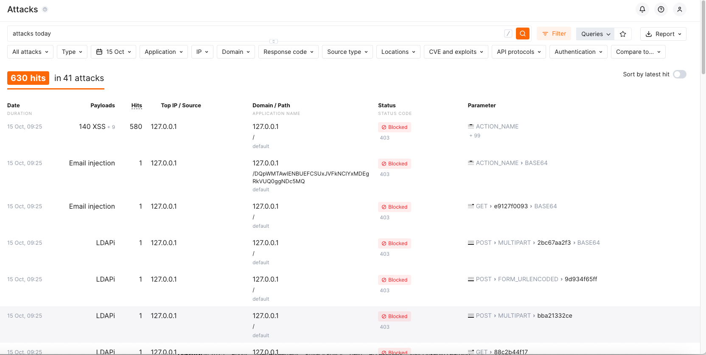

# Wallarm Solutions Engineer Technical Evaluation  
**Author:** Ed Maunders  
**Date:** October 2025  
**Deployment Method:** Docker (Host Networking)  
**Backend:** Python API / TicketBox (booking_api)  
**Attack Simulation:** GoTestWAF  

---

## 🧭 Overview

This project demonstrates the deployment, configuration, and validation of a **Wallarm Filtering Node** using **Docker**.

I chose Docker for its simplicity, portability, and reproducibility — ideal for proof-of-concept and lab testing environments.  

The Wallarm node was configured to inspect incoming traffic, forward clean requests to a backend API, and block malicious requests.  
I followed the official documentation here: [Wallarm Docker Deployment Guide](https://docs.wallarm.com/installation/inline/compute-instances/docker/nginx-based/)


 <p align="center">
  
  <br>

</p>

 Example Deployment Command

```bash
docker run -d --name wallarm-node --network host \
  -e WALLARM_API_TOKEN='{API_TOKEN}' \
  -e WALLARM_LABELS='group=ticketbox' \
  -e NGINX_BACKEND='http://127.0.0.1:8080' \
  -e WALLARM_API_HOST='audit.api.wallarm.com' \
  -e WALLARM_MODE='block' \
  wallarm/node:6.6.0
```

This setup allowed me to validate both detection and blocking capabilities using the GoTestWAF tool, simulating real-world attack traffic against the protected backend.

**Prerequisites**

Before deployment, ensure the following components are available:

- Host Environment: Ubuntu 22.04 or similar Linux environment

- Docker: Version 20.x or higher installed and running

- Wallarm API Token: Active token from the Wallarm Cloud Console

- Backend Application: TicketBox API reachable at http://127.0.0.1:8080

- GoTestWAF: Installed to generate and simulate attack traffic

- Internet Access: Required for Wallarm node registration via audit.api.wallarm.com

**Deploy Test Backend Application (TicketBox API)**

To validate that the Wallarm Node correctly forwards and filters traffic, a simple backend API was used — the TicketBox (booking_api) service.
This Python-based API simulates a real-world backend with endpoints for booking and session handling.
The application should be deployed locally on port 8080, so the Wallarm Node can forward clean traffic directly to it.

**Step 1: Clone and Run the Backend Application**

Clone the API from GitHub and start it locally using Docker:

```bash
git clone https://github.com/edmaunders/booking_api.git
cd booking_api
docker build -t booking_api .
docker run -d --name booking_api -p 8080:8080 booking_api
```
⚙️ Step 2: Verify Backend Functionality

Confirm that the backend is reachable before deploying the Wallarm Node:
```bash
curl http://127.0.0.1:8080/get


Expected response (example):

{
  "status": "ok",
  "service": "TicketBox Booking API",
  "message": "Backend running and reachable"
}
```
**Deploy Wallarm Filtering Node**

The Wallarm Node was deployed using Docker to inspect incoming HTTP traffic, forward clean requests to the backend API, and block malicious ones.

 Step 1: Create a Node in the Wallarm Console

Navigate to Configuration → Nodes in the Wallarm Console.

Click Create Node, enter a name, and select Deployment / Node Usage Type.

Copy the generated API Token — you’ll need this in the next step.

 Step 2: Deploy the Wallarm Node Container

Run the Wallarm Node container in host networking mode to intercept requests directly.
Replace {API_TOKEN} with your own from the Wallarm Console.

```bash

docker run -d --name wallarm-node --network host \
  -e WALLARM_API_TOKEN='{API_TOKEN}' \
  -e WALLARM_LABELS='group=ticketbox' \
  -e NGINX_BACKEND='http://127.0.0.1:8080' \
  -e WALLARM_API_HOST='audit.api.wallarm.com' \
  -e WALLARM_MODE='block' \
  wallarm/node:6.6.0
```
### Command Breakdown

| Parameter | Description |
|------------|-------------|
| `-d` | Runs the container in detached mode (background). |
| `--name wallarm-node` | Assigns a friendly name to the container. |
| `--network host` | Uses the host’s network stack so Wallarm can inspect traffic directly. |
| `-e WALLARM_API_TOKEN='{API_TOKEN}'` | Authenticates the node with Wallarm Cloud. |
| `-e WALLARM_LABELS='group=ticketbox'` | Adds metadata tags for node grouping. |
| `-e NGINX_BACKEND='http://127.0.0.1:8080'` | Defines the backend server for clean traffic. |
| `-e WALLARM_API_HOST='audit.api.wallarm.com'` | Specifies the API endpoint for your region. |
| `-e WALLARM_MODE='block'` | Enables blocking mode to deny malicious traffic. |
| `wallarm/node:6.6.0` | The Wallarm Docker image and version. |

**Step 3: Verify Deployment**

Check that the container is running:
```bash
docker ps
```
 <p align="center">
  
  <br>

</p>


View logs to confirm successful registration:
```bash
docker logs wallarm-node | grep "Wallarm node started"
```

Once registered, you’ll see the node in the Wallarm Console under Configuration → Nodes.

<p align="center">
  
  <br>

</p>


##Run GoTestWAF to Validate Wallarm Detection (Docker)##

Once both the backend API and Wallarm Node are running, use GoTestWAF to simulate legitimate and malicious requests.
This verifies that the Wallarm Node is detecting and blocking common web attacks such as SQL injection, XSS, and RCE.

Running GoTestWAF in a Docker container keeps the environment clean and avoids the need to install Go locally.

**Step 1: Download the GoTestWAF Docker Image**

Pull the latest GoTestWAF image from Docker Hub:
```bash
docker pull wallarm/gotestwaf
```
**Step 2: Run GoTestWAF**

Execute the following command to start the test and generate reports:
```bash
docker run --rm --network host -u 0:0 \
  -v ~/gotestwaf_reports:/app/reports \
  wallarm/gotestwaf \
  --url=http://127.0.0.1 \
  --noEmailReport \
  --blockStatusCodes=403 \
  --testSet owasp
```

###  Command Breakdown

| Option | Description |
|---------|-------------|
| `docker run --rm` | Runs the container and removes it automatically after the test completes. |
| `--network host` | Sends all requests through the Wallarm Node at `127.0.0.1`. |
| `-u 0:0` | Runs as root to ensure permissions for writing report files. |
| `-v ~/gotestwaf_reports:/app/reports` | Mounts a local folder on the host to store generated reports. |
| `wallarm/gotestwaf` | The official Wallarm GoTestWAF Docker image. |
| `--url=http://127.0.0.1` | Sets the target URL for testing (the Wallarm Node in blocking mode). |
| `--noEmailReport` | Disables email delivery of the report (useful for local testing). |
| `--blockStatusCodes=403` | Treats HTTP 403 responses as blocked attacks. |
| `--testSet owasp` | Runs the OWASP Core test suite (SQLi, XSS, RCE, etc.). |

**Step 3: Review Results**

Check the reports generated on your host:

```bash
ls -lh ~/gotestwaf_reports
waf-evaluation-report-2025-October-13-12-42-47.pdf
waf-evaluation-report-2025-October-13-12-42-47.csv
gotestwaf.log
```

Open the PDF report to review detection metrics such as:

Total Requests Sent

Blocked Attacks

Detection Coverage

False Negatives / Passed Attacks

<p align="center">
  
  <br>

</p>

## Check API Sessions and Attacks in the Wallarm Console

After running GoTestWAF, you can verify that the simulated traffic and detected attacks were correctly processed by your Wallarm Node and appear in the **Wallarm Console**.

---

### Step 1: View API Sessions

1. Log in to your Wallarm Console:  
   - [Audit Cloud](https://my.audit.wallarm.com)  


2. Navigate to **Events → API Sessions**.  
3. Confirm that your backend endpoints (e.g., `/get`, `/login`, `/book`) are visible.  
   - Each endpoint should show HTTP methods, request counts, and average response codes.  
 <p align="center">
  
  <br>

</p>

This confirms that the **Wallarm Node** successfully forwarded clean requests and recorded legitimate API traffic for analysis.

---

### Step 2: Review Detected Attacks

1. In the Console, open **Events → Attacks**.   
2. You should see multiple attack entries corresponding to the OWASP tests executed by GoTestWAF, such as:  
   - SQL Injection (`sqli`)  
   - Cross-Site Scripting (`xss`)  
   - Remote Code Execution (`rce`)  
   - Path Traversal (`pthtrv`)  
   - Command Injection (`cmdi`)
  
<p align="center">
  
  <br>

</p>

3. Click on any attack entry to view:  
   - **Full request and response details**  
   - **Attack type and risk score**  
   - **Detection point** (parameter, header, or URI)  
   - **Blocking status (403)**
  
<p align="center">
  
  <br>

</p>
This confirmed that the Wallarm Node was successfully operating in blocking mode, intercepting and denying the majority of simulated OWASP attacks.


# Summary of Findings
**Deployment & Configuration**

The Wallarm solution was simple to deploy, offering several flexible deployment options such as Docker, Kubernetes, and the NGINX module.
For this evaluation, the Docker deployment with host networking was used, enabling traffic inspection with minimal configuration.
Initial setup, registration, and token authentication completed successfully, and the node connected seamlessly to the Wallarm Cloud Console.

**Console & Usability**

- The Wallarm Console was intuitive and easy to navigate.
- Dashboards such as Attacks, API Discovery, and Events provided clear visibility into blocked and allowed requests, with detailed payload data for each event.
- Policy configuration and filtering were straightforward, making it easy to investigate results and tune rules.

**Test Execution**

GoTestWAF was used to simulate a range of common web attacks against the protected API endpoint.
A total of 816 tests were executed, covering 41 distinct attack types (including SQLi, RCE, XSS, and Path Traversal).

Metric	Result
- Total Tests	816
- Passed	708
- Failed	5
- Blocked Requests (403)	663
- Allowed Requests (200)	49
- Method Not Allowed (405)	102
- 
**Detection & Protection**

Wallarm effectively blocked approximately 81% of malicious payloads, returning 403 responses for the majority of attacks.
The small percentage of allowed requests (~6%) indicates potential tuning opportunities for broader rule coverage.
The presence of 405 responses confirmed that unsupported HTTP methods (such as PUT and DELETE) were also correctly handled.

**Overall Assessment**


- Simple and fast deployment process

- Comprehensive coverage of common web attack types

- Clear reporting and dashboards for analysis

- Accurate blocking with minimal false positives

- Effective API Discovery after generating sufficient traffic


# Troubleshooting Wallarm Node Registration
**Issue Summary**

Initially, the Wallarm node was deployed using a token from the Audit console (https://my.audit.wallarm.com/) but configured to connect to the EMEA cloud endpoint (api.wallarm.com).
Because tokens are bound to the console region they were generated in, the node could not authenticate with the API and failed to register.

**Observed Symptoms**

After running the node, the container logs showed repeated registration failures:
```bash
{"level":"error","component":"register",
"error":"deployCloudNode: wallarm error in register #7: wapi: PostEx: request [e53dfc4cdd766c597dd6e4f6e4f1dfca]: access denied",
"time":"2025-10-10T20:29:03Z","message":"node registration done with error"}

{"level":"warn","component":"nginx",
"message":"wallarm: protection disabled in /etc/nginx/nginx.conf:78"}
```

and sometimes:

```bash
wapi: SetApiCredentialsFromRegToken: illegal base64 data at input byte 5
wapi: PostEx: bad request [], body: <html><h1>405 Not Allowed</h1></html>
```
**Root Cause**

These errors indicated that:

The API token was valid, but for a different Wallarm console region.

The node was trying to register against the wrong API host (api.wallarm.com instead of audit.api.wallarm.com).

Because registration never succeeded, the Wallarm engine stayed disabled, showing warnings such as:

```bash
wallarm: protection disabled
cannot open proton.db file
```

The filtering node therefore proxied traffic but did not inspect or block attacks.

**Resolution Steps**

Stopped and removed the old container:

```bash
docker rm -f wallarm-node
```

Recreated the node with the correct Console endpoint and token:
```bash
docker run -d --name wallarm-node --network host \
  -e WALLARM_API_TOKEN='<AUDIT_NODE_TOKEN>' \
  -e WALLARM_API_HOST='audit.api.wallarm.com' \
  -e WALLARM_LABELS='group=ticketbox' \
  -e NGINX_BACKEND='http://127.0.0.1:8080' \
  wallarm/node:6.6.0
```

**Verified successful registration:**
```bash
docker logs -f wallarm-node --tail 50


 Output showed:

{"component":"register","message":"node registration start"}
{"component":"register","message":"node registration done successfully"}

```
Confirmed node appeared online in the correct Console (my.audit.wallarm.com → Nodes).


**References**

Wallarm Docker Deployment Docs

Wallarm API Tokens Guide

GoTestWAF Repository

Booking API GitHub Repo
